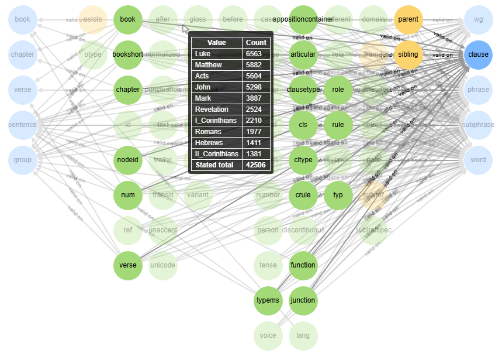

# Generating Text-Fabric Knowledge Graphs

This repository contains the following Jupyter Notebooks that can be used to create a JSON and/or an interactive visual representation of a Knowledge Graph representing a Text-Fabric dataset.

  -  [create knowledge graph.ipynb](create_knowledge_graph.ipynb): The basic notbook to generate the JSON Knowledge Graph.
  -  [generate_cytoscape_html.ipynb](generate_cytoscape_html.ipynb): This notebook adds x-y positions to the nodes and generates an interactive HTML file (cytoscape based).

# The end result

The following screenshot shows the generated visual presentation of the Knowledge Graph for the [N1904-TF dataset](https://github.com/CenterBLC/N1904). Click on the image to open the interactive view.

