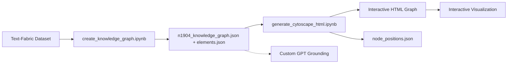
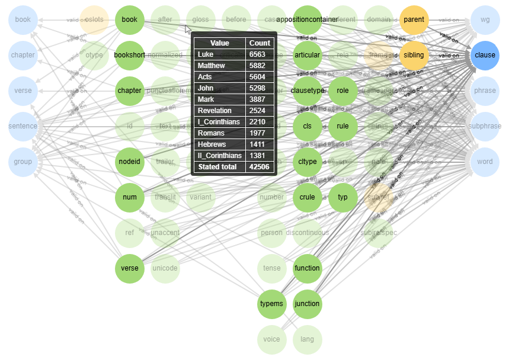

    

# Generating Text-Fabric Knowledge Graphs

This repository contains the following Jupyter Notebooks that can be used to create a JSON and/or an interactive visual representation of a Knowledge Graph representing a Text-Fabric dataset.

  -  [create knowledge graph.ipynb](create_knowledge_graph.ipynb): The basic notbook to generate the JSON Knowledge Graph.
  -  [generate_cytoscape_html.ipynb](generate_cytoscape_html.ipynb): This notebook adds x-y positions to the nodes and generates an interactive HTML file (cytoscape based).

# Diagram

This repository generates a knowledge graph from the Text-Fabric N1904 dataset with two main outputs. The general process is as follows:

```mermaid
flowchart LR
    TF[Text-Fabric Dataset] 
    --> NB1[create_knowledge_graph.ipynb] 
    --> JSON[n1904_knowledge_graph.json + elements.json]
    
    JSON --> NB2[generate_cytoscape_html.ipynb]
    NB2 --> HTML[Interactive HTML Graph]
    NB2 --> POS[node_positions.json]
    
    JSON -.-> GPT[Custom GPT Grounding]
    HTML --> Human[Interactive Visualization]

    click NB1 "https://github.com/tonyjurg/TF_Knowledge_Graph/blob/main/create_knowledge_graph.ipynb" "Open notebook: create_knowledge_graph.ipynb"
    click NB2 "https://github.com/tonyjurg/TF_Knowledge_Graph/blob/main/generate_cytoscape_html.ipynb" "Open notebook: generate_cytoscape_html.ipynb"
    click JSON "https://tonyjurg.github.io/TF_Knowledge_Graph/n1904_knowledge_graph.json" "Open JSON output"
    click HTML "https://tonyjurg.github.io/TF_Knowledge_Graph/n1904_graph_contextmenu.html" "Open interactive HTML graph"
    click POS "https://tonyjurg.github.io/TF_Knowledge_Graph/node_positions.json" "Open node positions JSON"
    click TF "https://centerblc.github.io/N1904/" "Open Text-Fabric N1904 dataset"
```

# The end result

The following screenshot shows the generated visual presentation of the Knowledge Graph for the [N1904-TF dataset](https://centerblc.github.io/N1904/). Click on the image to open the interactive view.

