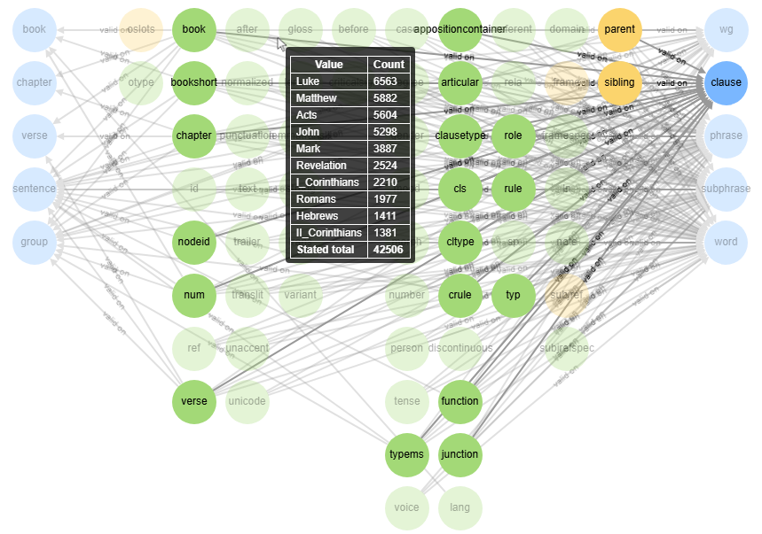

<h1>TF Knowledge Graph</h1><h2>What is TF Knowledge Graph?</h2>
TF Knowledge Graph contains Jupyter Notebooks for creating a knowledge graph from a <a href="https://github.com/annotation/text-fabric">Text-Fabric</a> dataset. Export the graph as JSON or explore it in an interactive visualization.

The included example uses the <a href="https://centerblc.github.io/N1904/">Nestle 1904 Greek New Testament dataset (N1904-TF)</a>.

For more information, see <a href="about.html">About TF Knowledge Graph</a>.
<h2>Explore the example</h2>
Open the N1904 knowledge graph to explore its nodes and relationships.

<a class="button" href="n1904_graph_contextmenu.html">Open interactive graph →</a>
<figure><figcaption>Select the image to open the interactive view.</figcaption></figure><h2>How to use TF Knowledge Graph</h2>
Generate the JSON graph, then use the visualization notebook to create an interactive HTML graph.

See <a href="usage.html">Using TF Knowledge Graph</a> for the workflow and downloadable outputs.
<h2>Licence</h2>
The software is available under the MIT licence. See <a href="legal.html">Legal</a> for the terms of use.

